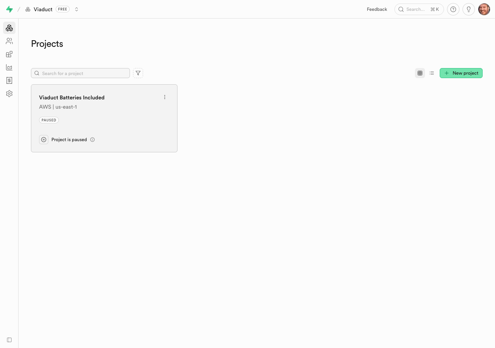
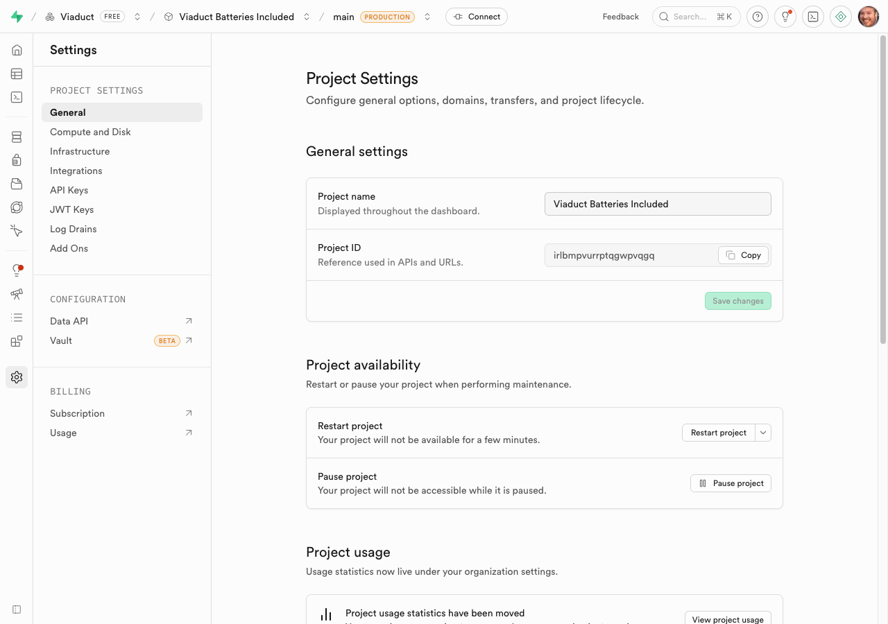
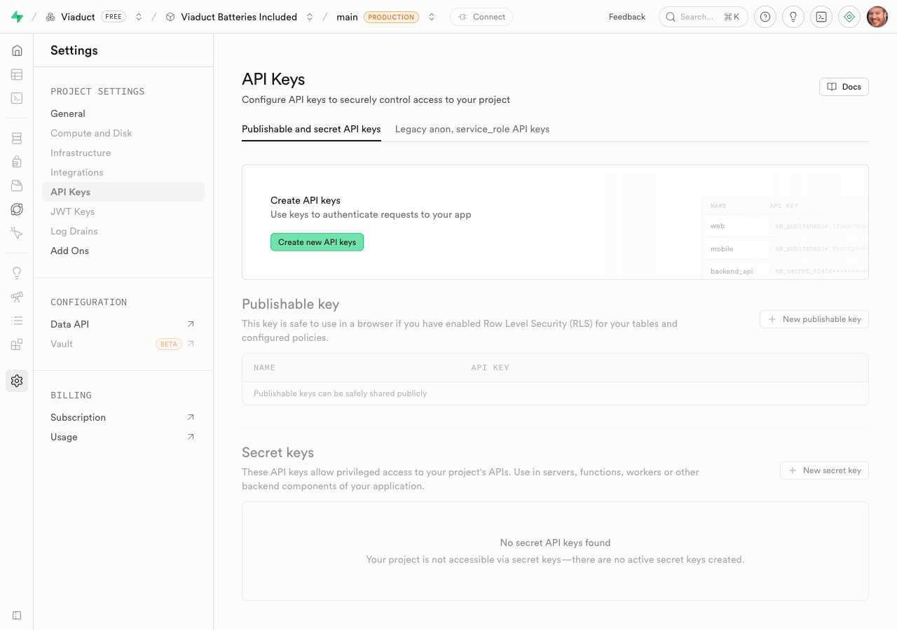
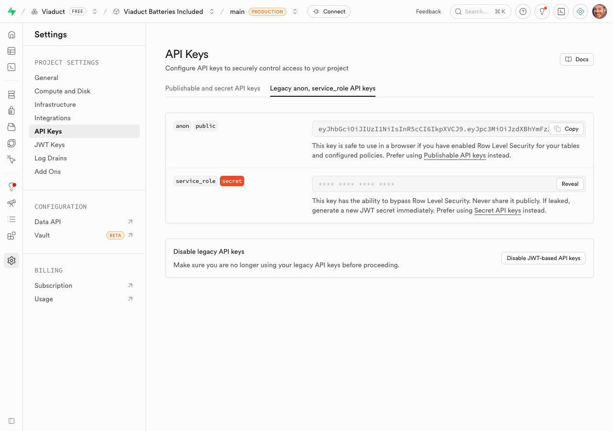
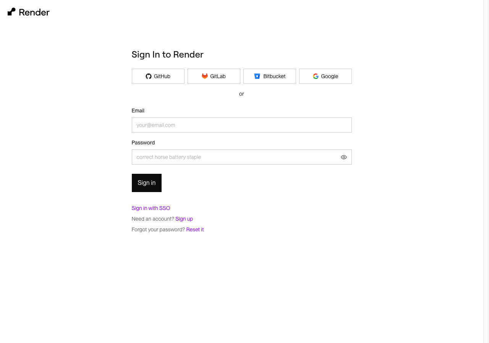
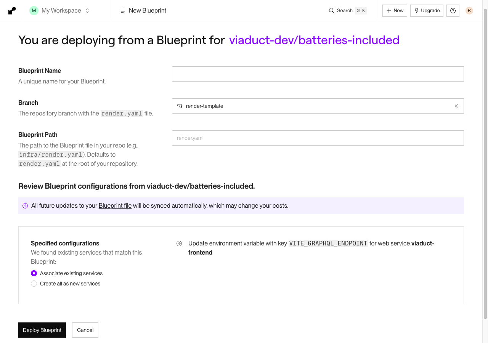
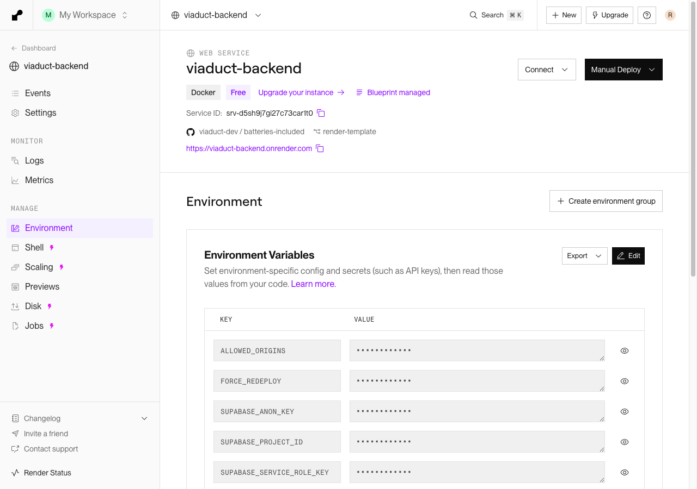
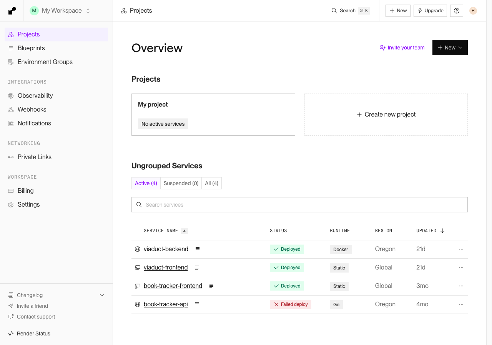
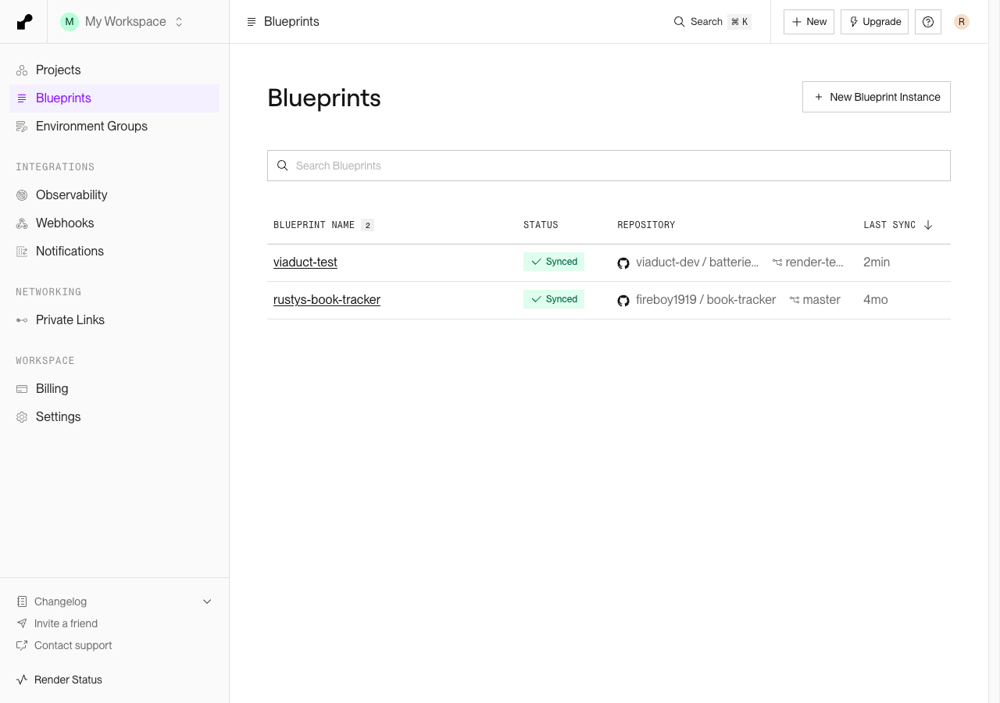
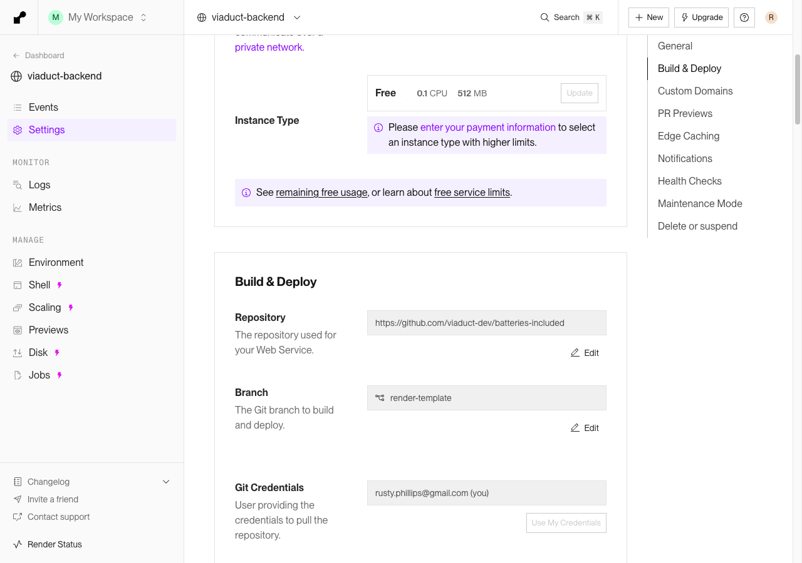

# Setup Guide

This guide walks you through deploying the Viaduct Batteries Included template to [Render.com](https://render.com) using a Render Blueprint, with [Supabase](https://supabase.com) as the database backend.

## Prerequisites

- A [GitHub](https://github.com) account
- A [Supabase](https://supabase.com) account (free tier works)
- A [Render](https://render.com) account (free tier works)

---

## Part 1: Get Your Supabase Credentials

Before deploying to Render, you need three values from your Supabase project:

| Value | Where to find it |
|-------|-----------------|
| `SUPABASE_PROJECT_ID` | Settings > General > **Project ID** |
| `SUPABASE_ANON_KEY` | Settings > API Keys > **Legacy anon, service_role API keys** tab |
| `SUPABASE_SERVICE_ROLE_KEY` | Settings > API Keys > **Legacy anon, service_role API keys** tab |

### Step 1: Create or select a Supabase project

1. Go to [supabase.com/dashboard](https://supabase.com/dashboard) and sign in.
2. Select your organization, then select your project (or create a new one).

### Step 2: Copy your Project ID

1. In the left sidebar, click **Project Settings** (gear icon at the bottom).
2. On the **General** tab, find the **Project ID** field.
3. Click **Copy** to copy it. Save this value -- you'll need it as `SUPABASE_PROJECT_ID` when deploying.

> **Note:** Your Supabase URL is derived from this Project ID: `https://<project-id>.supabase.co`

### Step 3: Copy your API keys

1. Still in Project Settings, click **API Keys** in the left sidebar.
2. Click the **"Legacy anon, service_role API keys"** tab (not "Publishable and secret API keys").

3. On the Legacy tab, you'll see two keys:
   - **anon** (public) -- Copy this value. This is your `SUPABASE_ANON_KEY`.
   - **service_role** (secret) -- Click **Reveal**, then copy. This is your `SUPABASE_SERVICE_ROLE_KEY`.

> **Important:** Use the keys from the **Legacy** tab, not the "Publishable and secret API keys" tab. The legacy `anon` and `service_role` JWT keys are what Supabase SDKs expect.

> **Security:** The `service_role` key bypasses Row Level Security. Never expose it in client-side code. It is only used server-side by the Viaduct backend.

### Step 4: Enable Email Auth

1. In the Supabase sidebar, go to **Authentication** > **Providers** > **Email**.
2. Make sure Email auth is **enabled** (it is by default on new projects).

---

## Part 2: Deploy to Render.com

### Step 1: Open the Blueprint deploy page

Click the link below to start deploying. This pre-fills the repository and branch:

**[Deploy to Render](https://dashboard.render.com/blueprints/new?repo=https://github.com/viaduct-dev/batteries-included&branch=render-template)**

If you're not signed in, you'll see the Render login page. Sign in with GitHub, GitLab, Google, or email.

### Step 2: Configure the Blueprint

After signing in, you'll see the Blueprint configuration page:

1. **Blueprint Name** -- Enter a name for your deployment (e.g., `viaduct-app`).
2. **Branch** -- Should already be set to `render-template`.
3. **Blueprint Path** -- Leave as the default (`render.yaml`).

### Step 3: Enter your Supabase credentials

Render will prompt you for the environment variables defined in `render.yaml`. Enter the three values you copied from Supabase:

| Render Environment Variable | Supabase Value |
|----------------------------|----------------|
| `SUPABASE_PROJECT_ID` | The Project ID from Settings > General |
| `SUPABASE_ANON_KEY` | The `anon` key from the Legacy API keys tab |
| `SUPABASE_SERVICE_ROLE_KEY` | The `service_role` key from the Legacy API keys tab |

You can verify or update these values after deployment by going to the [Render Dashboard](https://dashboard.render.com), clicking on **urbanmesh-backend**, then selecting **Environment** in the left sidebar. You'll see the three Supabase credentials listed there:

> The other environment variables (`ALLOWED_ORIGINS` and `VITE_GRAPHQL_ENDPOINT`) are auto-configured by Render using service linking -- you don't need to set them.

### Step 4: Deploy

Click **Deploy Blueprint**. Render will create two services:

- **urbanmesh-backend** -- A Docker web service running the Viaduct/Kotlin GraphQL backend
- **urbanmesh-frontend** -- A static site serving the React frontend

The backend build takes several minutes on the first deploy (JVM/Gradle build). Subsequent deploys are faster due to Docker layer caching.

### Step 5: Verify deployment

Once both services show **Deployed** status, your application is live.

You can also check the Blueprints page to confirm the blueprint is synced:

> **Note:** On the free tier, the backend spins down after ~15 minutes of inactivity. The first request after idle will take 30-60 seconds (JVM cold start). Upgrade to the Starter plan ($7/mo) in `render.yaml` for always-on.

---

## Troubleshooting

### Backend deploy fails
- Check the deploy logs in Render for error details
- Verify your Supabase credentials are correct
- Make sure the `service_role` key is from the **Legacy** tab

### Frontend can't connect to backend
- The `VITE_GRAPHQL_ENDPOINT` is auto-configured. Check that the backend is deployed and healthy first.
- Visit your backend's `/health` endpoint -- it should return `OK`

### Database migrations
Migrations from `schema/migrations/` run automatically on every backend deploy. The backend derives the database connection from the Supabase Project ID and service role key.

### Checking configuration
Visit your backend's `/setup` endpoint to see the current configuration status of your deployment.

---

## Next Steps: Fork and Customize

The Blueprint deploy above uses the `viaduct-dev/batteries-included` repository directly. To build your own application on top of this template, you'll want to fork the repository so you can make changes and have Render auto-deploy them.

### Step 1: Fork the repository

1. Go to [github.com/viaduct-dev/batteries-included](https://github.com/viaduct-dev/batteries-included).
2. Click **Fork** in the top-right corner.
3. Select your GitHub account (or organization) as the owner.
4. Keep the default branch settings and click **Create fork**.

### Step 2: Point your existing services to the fork

If you already deployed the template using the Blueprint in Part 2, you can switch each service to pull from your fork instead of creating a new Blueprint:

1. Go to the [Render Dashboard](https://dashboard.render.com) and click on a service (e.g., **urbanmesh-backend**).
2. Click **Settings** in the left sidebar.
3. Scroll down to **Build & Deploy**. You'll see the **Repository** and **Branch** fields with **Edit** buttons.
4. Click **Edit** next to **Repository** and change it to your fork's URL (e.g., `https://github.com/your-username/batteries-included`).
5. Optionally change the **Branch** to whichever branch you want to deploy from.
6. Repeat for the **urbanmesh-frontend** service.

Alternatively, you can create a fresh Blueprint deployment from your fork by going to [dashboard.render.com/blueprints/new](https://dashboard.render.com/blueprints/new), selecting your forked repository, and entering your Supabase credentials as described in [Part 2, Step 3](#step-3-enter-your-supabase-credentials).

### Step 3: Enable auto-deploy

By default, Render auto-deploys when you push to the connected branch. Every time you push changes to your fork, Render will automatically rebuild and deploy both the frontend and backend.

### Step 4: Start customizing

From here you can modify the template to build your own application:

- **Add database tables** -- Create new SQL migrations in `schema/migrations/`
- **Add GraphQL types and resolvers** -- Define schema in `backend/src/main/viaduct/schema/` and implement resolvers in `backend/src/main/kotlin/com/viaduct/resolvers/`
- **Build your UI** -- Add React components and pages in `src/`

See the project's `CLAUDE.md` and `docs/IMPLEMENTING_A_RESOURCE.md` for detailed guidance on adding new resources across all three layers.
